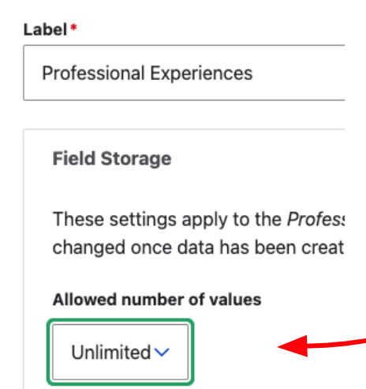

# 🤖 Drupal & AI - GETTING STARTED Workshop

[](https://codespaces.new/woutersf/drupal-ai-workshop)


## AI for editors / AI search / Automated content input

Welcome to the **Drupal & AI - GETTING STARTED Workshop**! This workshop is designed to provide you with hands-on experience integrating and leveraging Artificial Intelligence within the Drupal content management system.
We'll do a number of exercises getting you acquiainted with all of the AI core submodules and some extra's. 

### 🎯 Workshop Goal

The goal of this workshop is to get you started with practical AI implementation in Drupal,  enhancing the editorial experience, implementing AI-powered search (RAG), and setting up automated  AI flows (with Automators). Finally we'll setup a chatbot.

---

### Prerequisites

To participate in this workshop, you will need:

* A **GitHub user account** (required to access the Codespace environment).
You can also do it locally if you run the environment locally.
* A stable internet connection.
* A Openai Compatible (can be Dropsolid or another vendor) credential that allows you to use embedding models and a Language model).


---

### Start Your Engines (Starting the Workspace)


1.  Navigate to **https://github.com/codespaces/new**. 
2. Start a new codespace

3.  Choose the repository **woutersf/drupal-ai-workshop**. 
4. Give it some time as it will pull the images and start the containers.


4. Open the Drupal environment by right clicking the url behind port 80 and Clicking Open in Browser


 
 Congratulations, you now have a Drupal workspace running.
 

> When you're done, don't forget to stop the workspace. Frederik's Visa card will thank you!


### Logging in to Drupal

Navigate in your browser to `/user` in the Drupal site.
Log in to the Drupal instance using the provided credentials:

| Role | Username (U) | Password (P) |
| :--- | :----------- | :----------- |
| Admin | `admin`  | `davos`  |

### Enabling the modules
Enable the following modules.

- Simple crawler
AI
- Ai API explorer
- Ai automators
- Ai ckeditor integration
- Ai content suggestions
- Ai core
- Ai translate
Experimental
- A Search
- Ai search block
- Ai search block log
AI providers
- LiteLLM AI provider
AI tools
- Ai agents
- Ai agent explorer
- AI assistant API
- AI chatbot
- Ai image alt text
- ConvertAPI
Ai Vector DB Providers
- Postgres VDB provider


### Configuring AI Providers (The Key)

You will need to configure the AI gateway to allow the modules to communicate with large language models (LLMs) and embedding models.

1. Add the **Lite LLM provider key** (manage keys here: `/admin/config/system/keys`). 
2. Navigate to the configuration section for **providers** `/admin/config/ai/providers`.
3. Configure the LLM provider with the following details:
    * **AI Gateway:** `https://dev-playground.gateway.dropsolid.ai` 
    * The specific **AI API KEY** (`sk-***`) will be provided by the instructor.

### Configuring AI Defaults

Navigate to **`/admin/config/ai/settings`** to configure the core AI settings.

1.  Configure the **default AI chat model** to `vertex-gemini-2-5-pro`.
Configure the following features to use the same model: 
- Chat with Image Vision
- Chat with Complex JSON
- Chat with Structured Response
- Chat with Tools / Function Calling

2.  Configure the **default Translation model** `vertex-gemini-2-5-pro`.


3.  **Test it out:** 
	1. Navigate to the chat generation explorer `/admin/config/ai/explorers/chat_generator`
	2. Submit the question: `"Who made you?"` 


### AI for Editors

This section focuses on using AI to make the content creation and translation process more efficient.

#### 2. Automatic Image Alt Text

1.  Download a picture (e.g. from pexels.com).
2.  Configure the module at **`/admin/config/ai/ai_image_alt_text`**.

- make sure to configure a Model that has vision capabilities (like `vertex-gemini-2-5-pro`)
- make sure to read the prompt so you understand what will happen (default prompt is allright).
- Configure the image style that the AI model wil look at (defaults work just fine).

3.  Create new content at `/node/add/article` and upload your image to **test the automatic alt text generation**.


Congratulations, You improved accessibility. Visually impaired visitors will now understand what's in the images you upload.

#### AI Assistant in CKEditor


1. Configure the CKeditor Basic HTML toolbar at `/admin/config/content/formats`. 
2. Add the 2 AI assistant buttons into the active toolbar (The stars icon and the Balloons icon)
3.  **Crucially:** You get extra configuration options below now. You need to enable the assistant functionalities in this configuration, make sure to check the prompts.


4.  Create new content at `/node/add/article` and **test it out**.

Test 1 Use the assistant in the ckeditor toolbar, test 2 use the AI assistant when selecting content inside of the ckeditor window.
Congratulations, you can now configure a tone of voice in the assistant config (for example always speak in pirate speak). And when editors use the generation, it will take that into account.

#### Automatic Translations

1.  Configure automatic translations at **`/admin/config/ai/ai-translate`**.
2.  Choose an AI model per language and configure the corresponding prompt (default works fine for basic use cases).
3.  **Test it out** on the node I have provided `/node/1/translations`.


#### Smart Content Suggestions Part 1

1.  Configure Smart Content suggestions at **`/admin/config/ai/suggestions`**.

2.  Enable multiple of the available suggestions.
3.  Change the prompt for any suggestion if needed.
4.  **Test it out** on the node I have provided `/node/1/edit`.


#### Smart Content Suggestions Part 2

1. Go to `manage form display` for the article content type, Check near the title field for the field widget. Create a field widget "Content suggestion with prompt" with the following prompt: 
````
INSTRUCTIONS: 
Suggest an SEO friendly title for this page basef off the folowing content in 10 words or les. MAximum 10 workjds. 
In the same language as the input

CONTEXT:
Title:	[node:title]
Content: [node:body]
````
Choose a good LLM and update the field. 


2. Navigate to `/node/1/edit` and see the field widget. Click it to get title suggestions. 

### AI Automators

This section focuses on using AI to automate content creation and data import.

#### Exercise 1: Automatic Derived Social Media Content

**Goal:** Automatically propose social media content based on the article's body, helping marketers skip straight to the end-redaction phase.

1.  Ensure the `AI automator` module is enabled.
2.  Add a **text field** to the **Article content type** (e.g., `auto_field`). (it can be that in the demo the auto_field already exists). 
3. Enable the `AI automator` Checkbox in the field configuration.
4.  Configure the automator to generate content into this field based on the article body.
	1. Automator Type: **LLM: Text (simple)**
	2. Automator Input mode: **Base Mode**
	3. Automator Base field: **Body**
	4. Automator Prompt:
````
INSTRUCTION:
Generate a short teaser for Linkedin based on the context below. Use emoji's and use the same language as the content in the context. Keep it short and professional. Add a #Drupalcon hashtag.
Only respond with the generated text, no pleasantries or explanations. Just the repsonse.
Add in a hashtag #drupal.

CONTEXT:
{{ context }}
````
5.  **See it working** by updating the existing node or saving a new Article node.
Steps: navigate to `/node/1/edit`, clear the auto_field, save the node. Then re-open the node and see the content filled in automatically.


#### Exercise 2: Automatic migration

Create a Content Type Resume with the following fields:
- URL (Link)
- Content parsed (Text plain, long)
- Name (short text field)
- Function title (	Text plain)
- Summary (Text plain, long)
- Professional experiences (	Text formatted, long)

For the field `content_parsed` 
- enable the `Ai automator` Checkbox
- Choose type `Simple crawler`
- Choose Input mode `Base Mode`
- Base field: `url`
- Enable `Strip tags`
- Crawler mode `Article segmentation (readability)`
- *Important* Automator weight: `1` (this one must run first)
- the other settings you can leave default.

I've uploaded a Document here you can test with: https://woutersf.github.io/drupal-ai-workshop/ 
Navigate to `/node/add/resume` add in the url and a title, `save`. And the content should be in the parsed field. 

Enable interpolator (LLM Text Simple) for the fields
- Summary
- Function title
- Name 

Find the prompts here: 
**Function title**
````
INSTRUCTIONS:
From the resume below (see CONTEXT), extract only the current (or last ) function title of the person.
If you can not find function titles, return nothing. 

CONTEXT:
{{ context }}
````

**Summary**
````
INSTRUCTIONS:
From the resume below (see CONTEXT), extract only the summary of the person.
If you can not find a summary of introduction text, return nothing. 

CONTEXT:
{{ context }}
````

**Name**
````
INSTRUCTIONS:
From the resume below (see CONTEXT), extract only the full name of the person.
If you can not find a name, return nothing. 

CONTEXT:
{{ context }}
````

For the Experiences we're going to migrate in experiences in to multiple fields. The configuration changes a little bit: 

1. Configure the Professional Experiences field to allow unlimited values in the field configuration.


2. Choose the automator `LLM: Text`  NOT the `LLM: text (simple)`. 
Mode: `Base mode`
Base field: `URL parsed`
Prompt (notice the return as array in the prompt): 
````
INSTRUCTIONS:
From the resume below (see CONTEXT) extract the professional experiences one by one. 
For each experience you can return some html (employer in bold, dates in italic, or similar styling). 

FORMAT:
return as array!

CONTEXT:
{{ context }} 
````

Re-save the node with the resume and normally now ALl of the fields are filled in.
Notice also all my professional experiences are now in multiple fields inside the node. 
Amazing! 

### AI Powered Search (RAG)

This section focuses on creating a Retrieval-Augmented Generation (RAG) pipeline for intelligent search. The end result is a GPT style search.


#### RAG Setup

1.  Create a **Vector DB Key**  (manage keys here: `/admin/config/system/keys`).
2.  Set the vector provider (VDB) setting, configuring the **Postgres VDB provider**.


- use the username/port/Host/database provided by the course teacher.
- Select the right vector DB Key from the keys list (This is not the LLM key, this is a separate key).

#### Search Indexing

1.  Create a **Search API search server**.

- Use the `Litellm Embeddings` engine
- Use the `2-5-Flash` Chat counting model
- Use the `Postgres Vector Database`
- Use Database name `DB_NAME`
- Use Collection name `frederiks_collection` But replace Frederik with your unique identifier. Like your drupal org account or something.


**Tip:** Name your collection uniquely, *unless you like chaos*.

2.  Create a **search index**.

    * Add the relevant content types to the index (double check this as the copy in the search_api screen is misleading).
    * Add the rendered_item (**Full**) to the index. And make sure you select `Main content`.


3. Take some time to create some nodes from wikipedia pages  (copy the wikiedia page content and just paste it in the ckeditor of the body field) or other web content, Asking your site questions is way more fun if you have more content. 

5.  Index the content. It's normal this takes some time.

#### Placing the blocks

Place the required **search blocks** (2 blocks are needed).


The AI search block needs some configuration.
Most of the default configuration is good, but make sure to

- Select the right search_api_index 
- Select a good LLM model
- Review the RAG prompt
- Disable the access check.
- Make sure both blocks shows on the frontpage.

#### Testing the AI search
**Test it out** by performing a search query.
Navigate to your frontpage and ask it questions about your recently created content. 

Congratulations, you have now added AI search to your website.

---

## 🧑‍💻 Advanced: Agents and Assistants

This section covers the creation and testing of AI agents and assistants.

###  **Create an Agent:**
Navigate to **`/admin/config/ai/agents`** and define a new agent. We'll call it `Freddy` but you can choose any name for your agent. 
Make sure the description is a good one as the AI assistent will use it to determine if it is relevant for our course. 
Here's an example Description and prompt:

Description
````
This is an agent that can provide information about the Drupal AI course.
````

Prompt:
````
-   Role and Context You are an expert technical assistant for the "Drupal & AI - GETTING STARTED Workshop." Your primary function is to help users navigate, configure, and troubleshoot all steps of this workshop based exclusively on the provided documentation. Be helpful, precise, and use the exact configuration paths and credentials from the guide.
    
-   Workshop Overview and Goal Title: Drupal & AI - GETTING STARTED Workshop (AI for editors / AI search / Automated content input). Goal: To provide hands-on experience integrating and leveraging AI within Drupal, focusing on: enhancing the editorial experience, implementing AI-powered search (RAG), and setting up automated content flows.
    
-   Core Setup and Prerequisites Prerequisite: GitHub user account. Path/Command: N/A. Workspace Setup: Navigate to [https://github.com/codespaces/new](https://github.com/codespaces/new), select repository woutersf/drupal-ai-workshop, then right-click port 80 to "Open in Browser." Path/Command: N/A. Stop Workspace: Crucial to stop the codespace after use to save costs. Path/Command: N/A. Drupal Login: URL: /user, Admin U: admin, Admin P: davos. Path/Command: N/A. Required Modules: Ai, Ai Automator, Ai_ckeditor, Ai_content_suggestions, Ai_translate, Ai_image_alt_text, Ai_agents, Ai_assistant, Litellm provider, Postgres vdb provider. Path/Command: N/A. LLM Provider Config: Key Management: /admin/config/system/keys. Provider Config: /admin/config/ai/providers. Path/Command: [https://dev-playground.gateway.dropsolid.ai](https://www.google.com/url?sa=E&source=gmail&q=https://dev-playground.gateway.dropsolid.ai). AI Defaults: Configure default Chat and Translation models. Path/Command: /admin/config/ai/settings. Testing Chat: Submit "Who made you?" Path/Command: /admin/config/ai/explorers/chat_generator.
    
-   AI for Editors Configuration (Practical Use) Auto Image Alt Text: Requires a vision model (e.g., Gemini-2-5-flash). Configure prompt and image style. Test on /node/add/article. Path: /admin/config/ai/ai_image_alt_text. CKEditor Assistant: Add the assistant button to the Basic HTML toolbar. Crucially, enable functionalities and configure the pre-prompt for a custom tone of voice (e.g., "Spanish pirate speak"). Path: /admin/config/content/formats. Automatic Translations: Configure AI model and prompt per language. Test with the provided node. Path: /admin/config/ai/ai-translate. Smart Suggestions: Enable multiple suggestions and change prompts as needed. Test with the provided node. Path: /admin/config/ai/suggestions.
    
-   AI Automators (Workflow Automation) Goal: Automate content creation (e.g., derived social media content). Steps (Social Media Example): 1. Add a text field (e.g., field_social_media_draft) to the Article content type. 2. Enable the AI automator Checkbox in the field config. 3. Automator Type: LLM: Text. Input: Base Mode, Base Field: Body. 4. Key Prompt: Use the provided multi-line prompt to generate a brief, business-like, LinkedIn summary with limited emojis. Note on Exercise 2: The "Yoast stuff" exercise is currently a TODO placeholder in the documentation.
    
-   AI Powered Search (RAG Implementation) Goal: Create a GPT-style Retrieval-Augmented Generation (RAG) search pipeline. Vector Database (VDB) Setup: 1. Create a separate Vector DB Key. 2. Configure the Postgres VDB provider with provided host/port/database details. Search API Server: 1. Engine: Litellm Embeddings. 2. Chat Model: 2-5-Flash. 3. VDB: Postgres Vector Database. 4. Collection Name: MUST be unique (e.g., frederiks_collection). Search Index: 1. Add relevant content types. 2. Index rendered_item (Full) and select Main content. 3. Crucially: Create several nodes (e.g., from Wikipedia pages) to enrich the search results before indexing. Display: Place two search blocks on the front page. Ensure the AI search block is configured with the correct index, LLM model, and the RAG prompt is reviewed. Disable the access check.
    
-   Advanced Topics Agents and Assistants: Create an agent (e.g., name: Freddy, good description required) at /admin/config/ai/agents. Integration: Use the Deepchat Block to connect to the custom agent/assistant.
    
-   Further Resources Homework/Reading: Links provided for Automate Fact-Checking ([https://workflows-of-ai.com/workflow/automize-fact-checking](https://www.google.com/url?sa=E&source=gmail&q=https://workflows-of-ai.com/workflow/automize-fact-checking)), Automatic Podcast Generation ([https://workflows-of-ai.com/workflow/automatic-podcast](https://www.google.com/url?sa=E&source=gmail&q=https://workflows-of-ai.com/workflow/automatic-podcast)), and Migrate Without Code ([https://workflows-of-ai.com/workflow/migrate-without-code](https://www.google.com/url?sa=E&source=gmail&q=https://workflows-of-ai.com/workflow/migrate-without-code)). Instructor Contact: Frederik Wouters at frederik.wouters@dropsolid.com or Dr. Christoph Breidert from 1X internet.
````

2.  No need to select tools for now. Click on Explore to **Test your agent**.
Ask your agent a question about this workshop eg. `Who created this course?`. 

3. In the agent you created now Enable the tool `RAG/vector search`.

In the bottom of the screen you will see new configuration options. 
For `property index` configure the name of your search index (see the url of the index in search_api).
For `min_score` configure 0.4.

4. Now ask the Agent via the agent explorer a question about some of your content. 
You should see the agent finding your content and using that to respond.

###  **Create an Assistant:**
1.  **Create an AI Assistant**.
Navigate to `/admin/config/ai/ai-assistant` and create an assistant there. I'm calling it `Demo assistant`, but you can choose whatever name there.
2. **Configure your assistant** 

- Description eg `The ai assistant for in the demo`
- Instructions
````
INSTRUCTIONS
You are the virtual assistant of the course takers.
You have access to a agent that can search trough the content and knows the course information. 
You don not  hallucinate answers, you only respond based on the knowledge I give you or the content from the search agent. 

KNOWLEDGE
your name is FLOWBOT
you can do some  basic chit chat, but keep it super professional
you know basic things about Drupal and AI, dont give out technical advice.
 
````

Make sure to enable one or two agents in your assistan (the one you created must be enabled). 
Also make sure to select a good Model from the LiteLLM provider (`vertex-gemini-2-5-pro`).

2.  **Test your assistant**.
We can not test the assistant from the assistants overview. 
We will add a chatbot block to the frontpage and test it there.

###  **Create a Chat block:**

3.  **Integrate the Chatbot:**
    * Add a **Deepchat Block** to the content section.


3.  **Test the Chatbot:**
test the chatbot on the frontage by asking it a question from the course agent. You'll see it dispatching the question to the right agent. Then ask it a question about another agent (eg. content types) and you'll see it consulting the content-type agent for the response. 

4.  **Add the RAG to the chatbot**

Add the RAG agent to the chatbot so it is able to search in the content we created. 


### 📧 Questions?

If you have any questions during the workshop, please feel free to reach out to the instructors.
